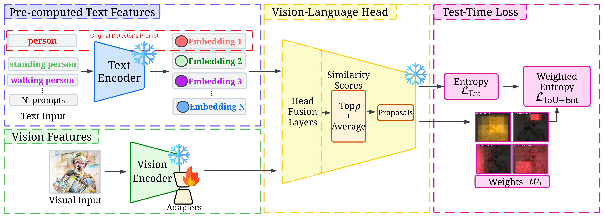
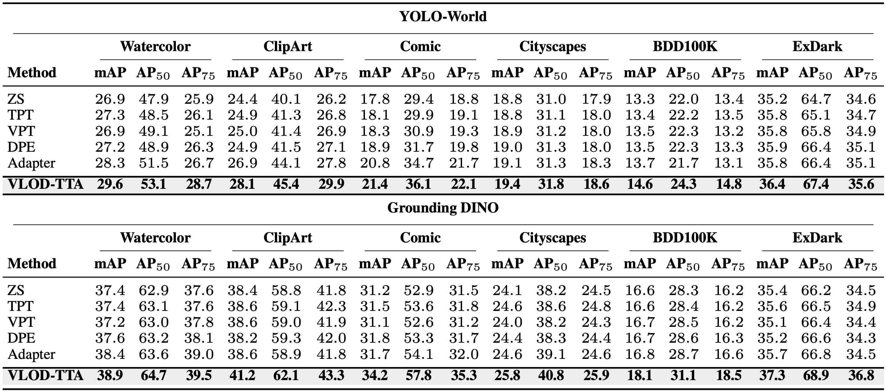
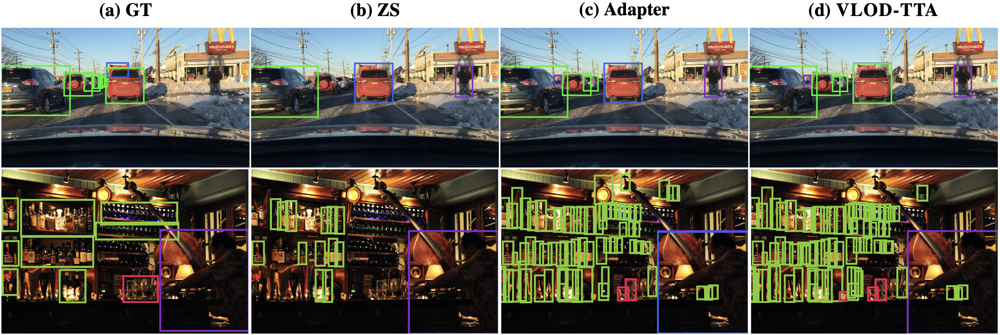

# VLOD-TTA: Test-Time Adaptation of Vision-Language Object Detectors

This is the repository for our paper: 

**VLOD-TTA: Test-Time Adaptation of Vision-Language Object Detectors**<br>
Atif Belal, Heitor R. Medeiros, Marco Pedersoli, Eric Granger

<p align="center">

</p>

## TL;DR
VLOD-TTA adapts VL-ODs (e.g., YOLO-World, Grounding DINO) at inference with IoU-weighted entropy and image-conditioned prompt selection, optimizing lightweight adapters while preserving zero-shot capability.

## News

 - Paper is under review, code will be released soon.
 - arXiv - [Paper](https://arxiv.org/abs/2510.00458)

## Benchmarking

<p align="center">

</p>

<p align="center">

</p>

## Citation

If you find our work helpful for your research, please consider citing the following BibTeX entry.

```bibtex
@misc{belal2025vlodtta,
      title={VLOD-TTA: Test-Time Adaptation of Vision-Language Object Detectors}, 
      author={Atif Belal and Heitor R. Medeiros and Marco Pedersoli and Eric Granger},
      year={2025},
      eprint={2510.00458},
      archivePrefix={arXiv},
}
```
